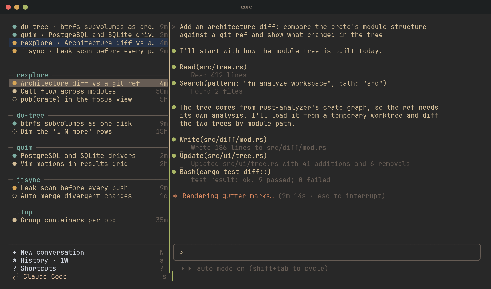

# corc

One tmux TUI for all your Claude Code, Codex, Cursor CLI and OpenCode
conversations: see what each agent is doing and jump between them instantly.



- **Every agent in one sidebar**, grouped by project, with live status:
  running, waiting on a question, finished but unseen, idle or dead.
- **Instant switching.** Agent panes live in a hidden tmux session and are
  swapped into view, so nothing restarts when you change conversation.
- **Nothing gets lost.** Conversations stay listed after they exit or you
  reboot, and `Enter` resumes them with the CLI that started them.
- **Live browser view.** When an agent drives a browser through Playwright,
  corc shows the page next to it in the terminal.
- **Worktree-aware directory picker** that expands each repo into its git
  worktrees and jj workspaces.

## Install

```sh
curl -fsSL https://github.com/HectorBjernersjo/corc/releases/latest/download/install.sh | sh
```

Or from source: `cargo install --git https://github.com/HectorBjernersjo/corc`.

Needs tmux 3.3+ and at least one agent CLI on your `PATH`. Linux and macOS.

## Usage

```sh
corc            # open corc (creates the _corc tmux session)
corc doctor     # check tmux, agents, PATH and the browser view's setup
```

Bind it to a key in `~/.tmux.conf` to reach it from any session:

```tmux
bind -n C-q run-shell "corc open"
```

| Key | Action |
|---|---|
| `j`/`k`, `Enter` | move, view (and resume) a conversation |
| `n` / `N` | new conversation here / in a picked directory |
| `s` | switch which agent new conversations use |
| `b` | browser view on/off |
| `/` | filter |

More in [docs/usage.md](docs/usage.md) (all keys, commands and the directory
picker), [docs/agents.md](docs/agents.md) (how each CLI is spawned and
tracked) and [docs/browser-view.md](docs/browser-view.md).
